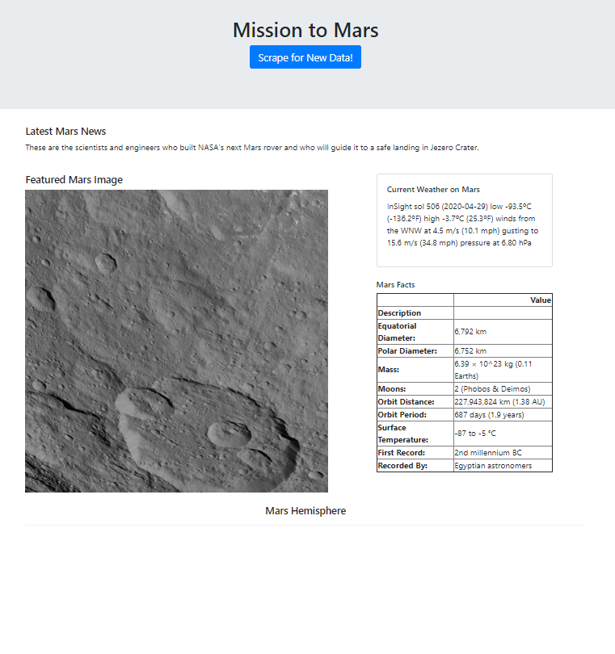

# Web-Scraping-Challenge

Using Jupyter Notebook, BeautifulSoup, Pandas, and Requests/Splinter I have built a web application that scrapes various websites for data related to Mars and displays the information in a single HTML page.

## Web Scraping

The first step was to scrape the NASA Mars website for the first headline title and its headline text using splinter and jupyter notebook.

Next, I scrapped the NASA Jet Propulsion Laboratory sight to retrieve the featured image url.

After that, I scrapped the Mars Weather twitter account to retrieve the mars weather from the latest tweet.

Then, I pulled Mars Facts from the Space Facts website, Space Profile table, using pandas to retrive the data and store the table html in a string. 

Lastly, I scrpped Astrogeology website for text of the names of each hemisphere and the url to each hemisphere image and stored this information on a python dictonary (NOTE: The website was down at the time of final scrapping and there full this information could not be extracted).

## MongoDB and Flask Application

After completing the web scraping and assigning mars info to specific variables, I used MongoDB with Flask templating to create a new HTML page that displays all of the information that was scraped from the URLs above.

I created a python file that contained a "scrape" function to scrape for the information we scraped in our jupyter notebook and return this information in a variable containing a dictionary. 

After creating the scrape function I created a separate python filed to called upon the scrape function in our previous python file and create/store the data in a Mongo Database. This step satisfied the completion of scraping webpages and store the informatoin in to MongoDB.

In order to serve the information in MongoDB to a html and flask application, I next had to create and html file and insert python variables that store our scraped data in to the html. These variables will be updated when we activate our flask application, which calls upon our scrape function. 

Lastly, I created another python file to run our flask application that scrapes the webpages for data related to Mars and displays the information in a single HTML page. Moreover, the webpage display a scrape button that can be clicked and will repeated the scraping process and update the HTML page with updated data.

## Sources

* https://mars.nasa.gov/news/?page=0&per_page=40&order=publish_date+desc%2Ccreated_at+desc&search=&category=19%2C165%2C184%2C204&blank_scope=Latest

* https://www.jpl.nasa.gov/spaceimages/?search=&category=Mars

* https://twitter.com/marswxreport?lang=en

* https://space-facts.com/mars/

* https://astrogeology.usgs.gov/search/results?q=hemisphere+enhanced&k1=target&v1=Mars
